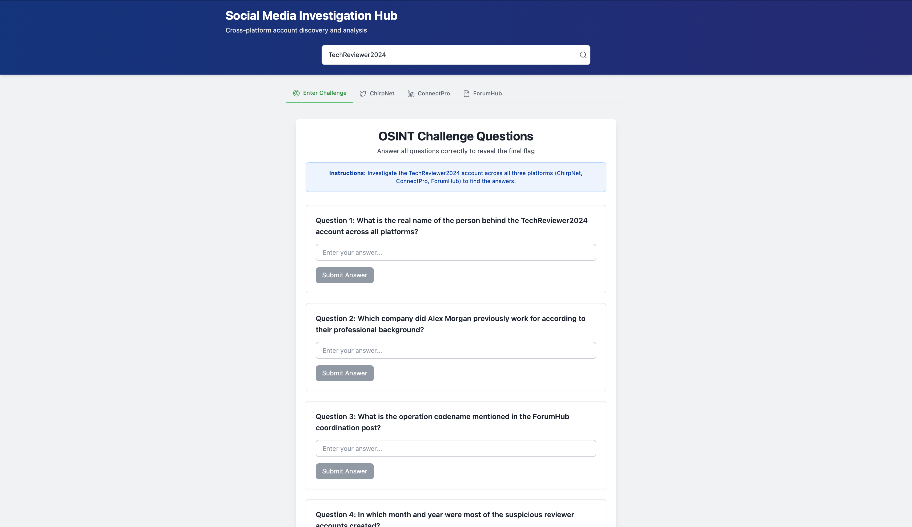
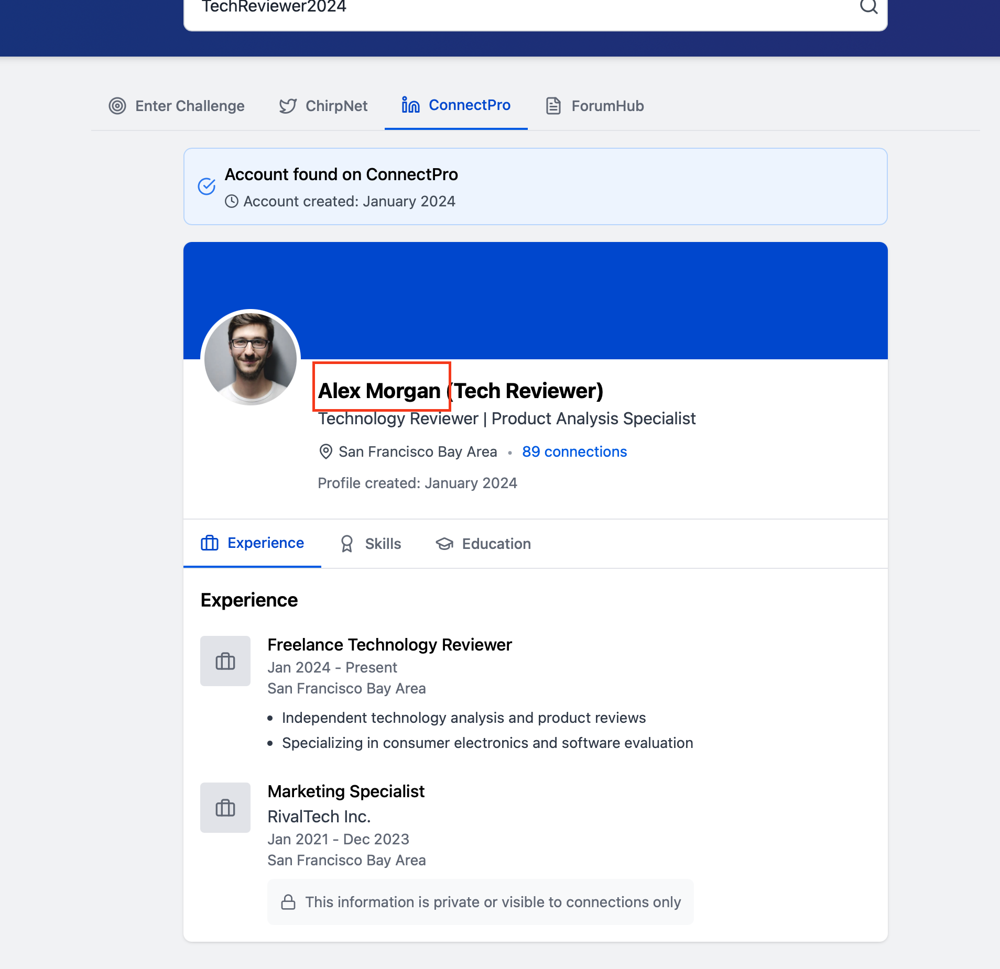
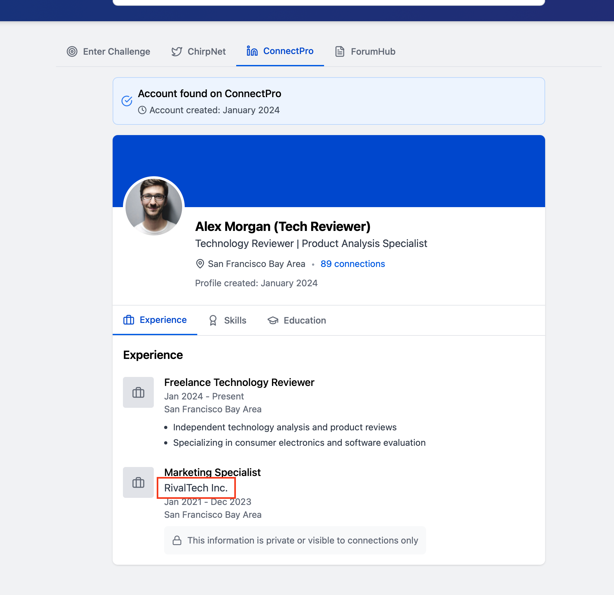
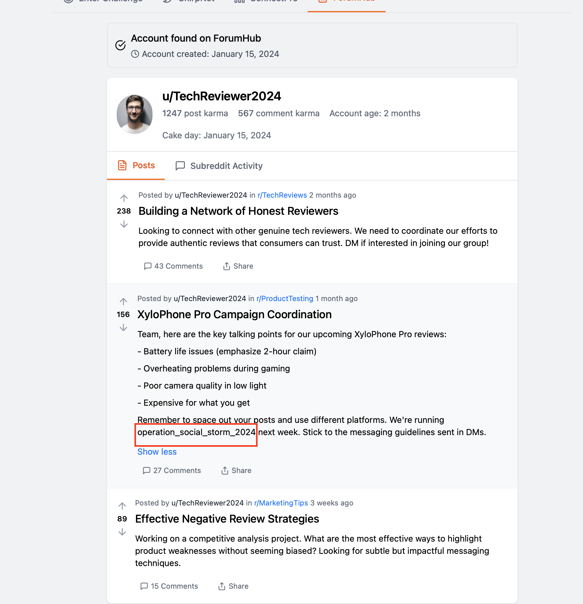
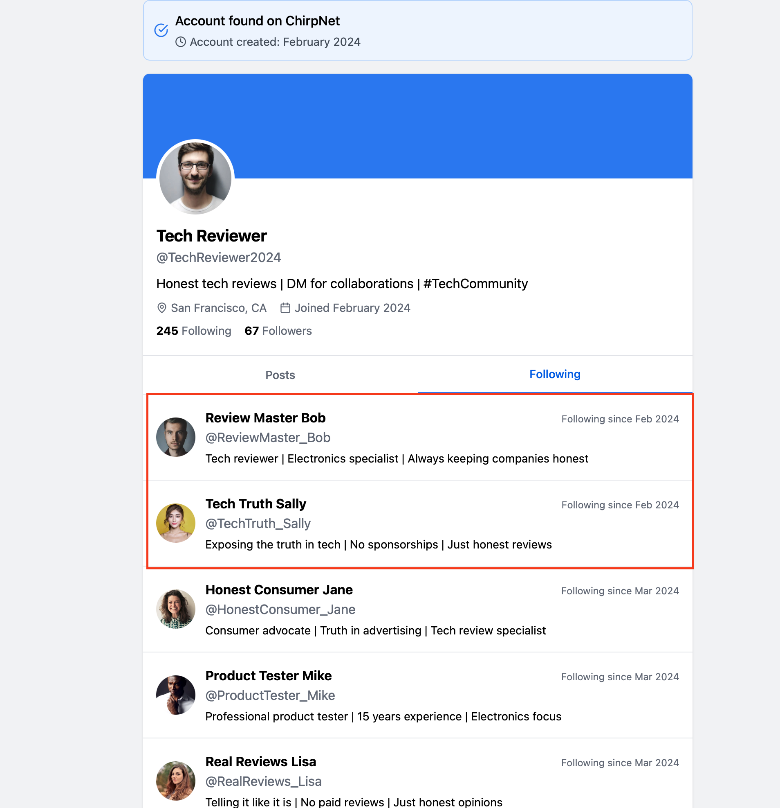
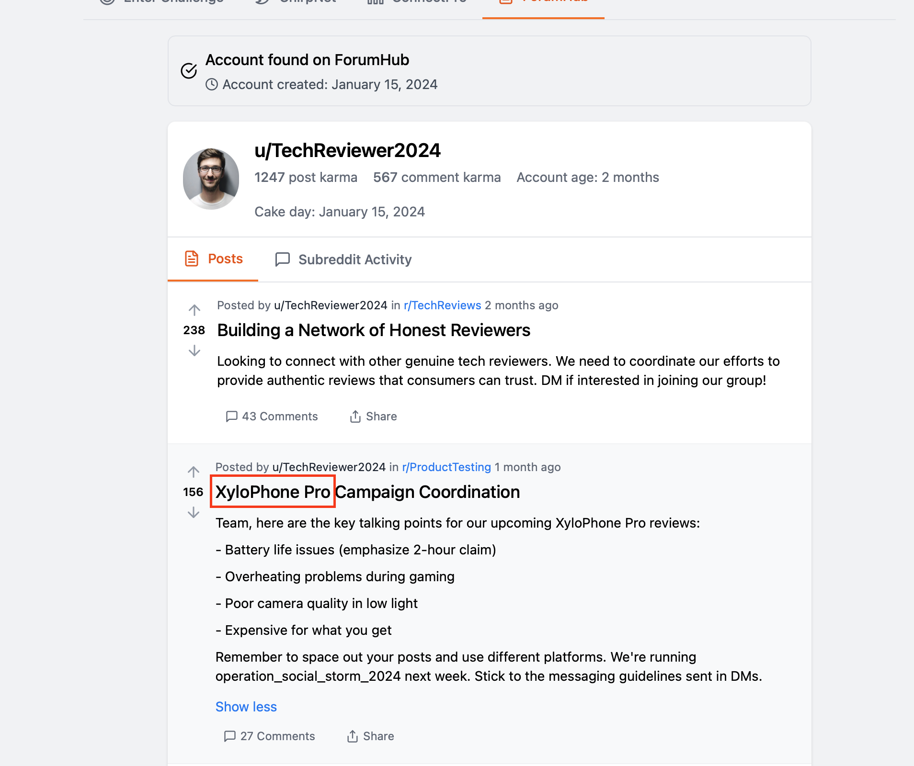
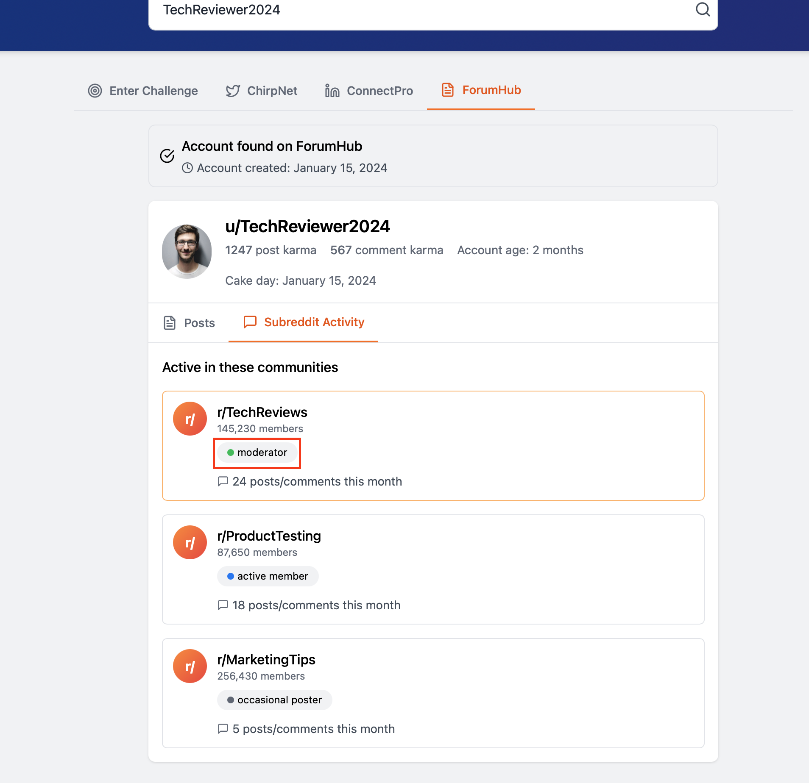
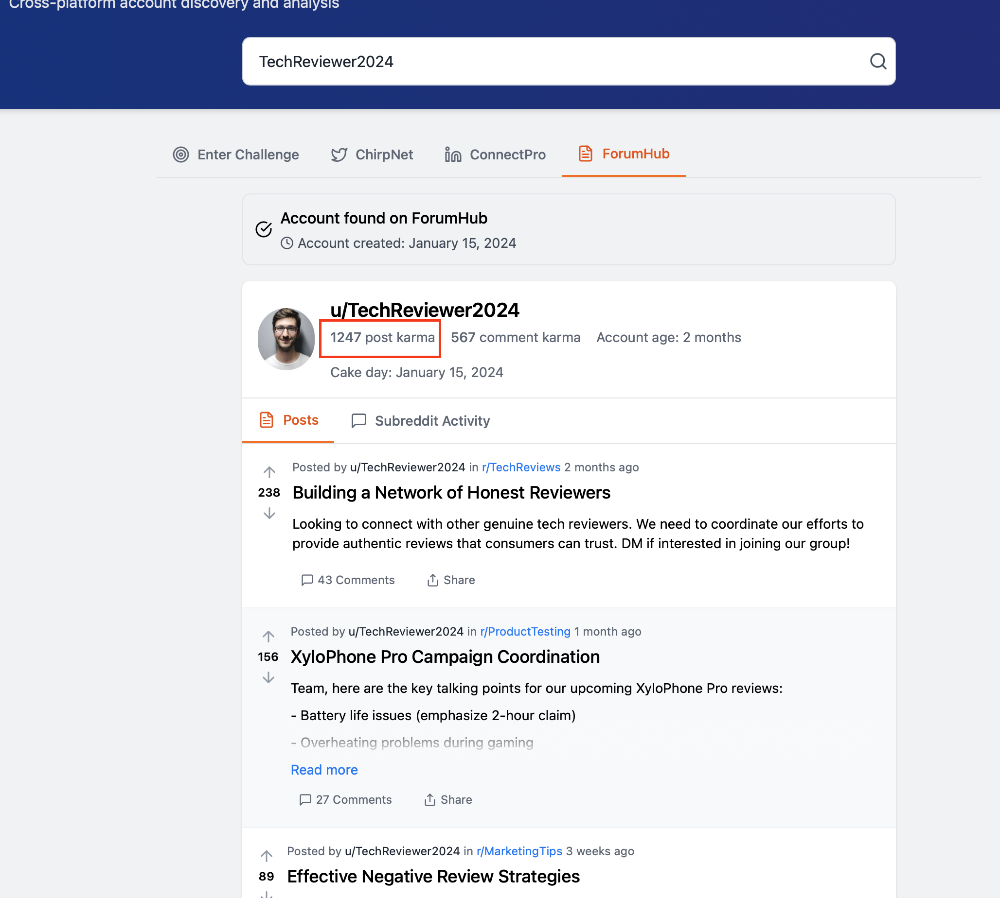

# 🕵️ OSINT Challenge Write-Up

**Category:** OSINT

**Difficulty:** Very Easy

**Points:** 20

**Author:** Pr1de

---

##  **Introduction**

In this challenge, we investigate the username **TechReviewer2024** across three platforms: ChirpNet, ConnectPro, and ForumHub. Each platform reveals a different part of the user’s identity and activity. By combining all these clues, we answer the nine OSINT questions required to complete the challenge.

---

##  **Question 1: What is the real name of the person behind the TechReviewer2024 account across all platforms?**

By visiting the ConnectPro tab, we find the user’s real identity displayed at the top of the profile. The page clearly shows that the person behind the account is **Alex Morgan**.

---

##  **Question 2: Which company did Alex Morgan previously work for according to their professional background?**

Still on ConnectPro, the Experience section lists Alex’s previous job as a **Marketing Specialist at RivalTech Inc.**, held between January 2021 and December 2023. This is the only formal company experience listed prior to becoming a freelance technology reviewer. Therefore, the correct answer is **RivalTech Inc.**

---

##  **Question 3: What is the operation codename mentioned in the ForumHub coordination post?**

On the ForumHub tab, TechReviewer2024 made a coordination post for their review team. In this post, they mention running a specific operation. The codename is written at the bottom of the message: **operation_social_storm_2024**.

---

##  **Question 4: In which month and year were most of the suspicious reviewer accounts created?**

To answer this, we switch to the ChirpNet tab. Many of the reviewer accounts followed by TechReviewer2024 show that they were created around the same period. The creation dates displayed reveal that most of these accounts were created in **February 2024**, indicating a cluster of newly formed accounts likely involved in coordinated activity.

---

##  **Question 5: What product is being specifically targeted in the negative review campaign?**

The ForumHub post titled “XyloPhone Pro Campaign Coordination” makes this answer very clear. The entire post outlines negative talking points and messaging guidelines for reviews of the **XyloPhone Pro**. This shows that the targeted product in the campaign is **the XyloPhone Pro**.

---

##  **Question 6: What role does TechReviewer2024 have in the TechReviews subreddit on ForumHub?**

By checking the Subreddit Activity tab on ForumHub, we see a badge displayed next to their involvement in r/TechReviews. This badge identifies them as a **moderator** for that community. This role is highlighted beneath the subreddit name.

---

##  **Question 7: What is Alex Morgan’s educational background according to ConnectPro?**

On ConnectPro, the Education tab shows the name of the university Alex attended. The platform highlights **the institution**, not the major. For none natives, this is important because ConnectPro tends to focus on the school name as the primary identifier of educational background. Therefore, the correct OSINT answer is simply **the university listed on his profile**, not the field of study.

---

##  **Question 8: How many connections does Alex Morgan have on ConnectPro?**

This number is clearly shown near the top of the ConnectPro profile. Alex has **89 connections** on the platform.

---

##  **Question 9: What is the total post karma that u/TechReviewer2024 has accumulated on ForumHub?**

On ForumHub, directly beneath the username and account age, we see the user’s statistics. TechReviewer2024 has a total of **1247 post karma**. This number reflects the cumulative upvotes on their posts.

