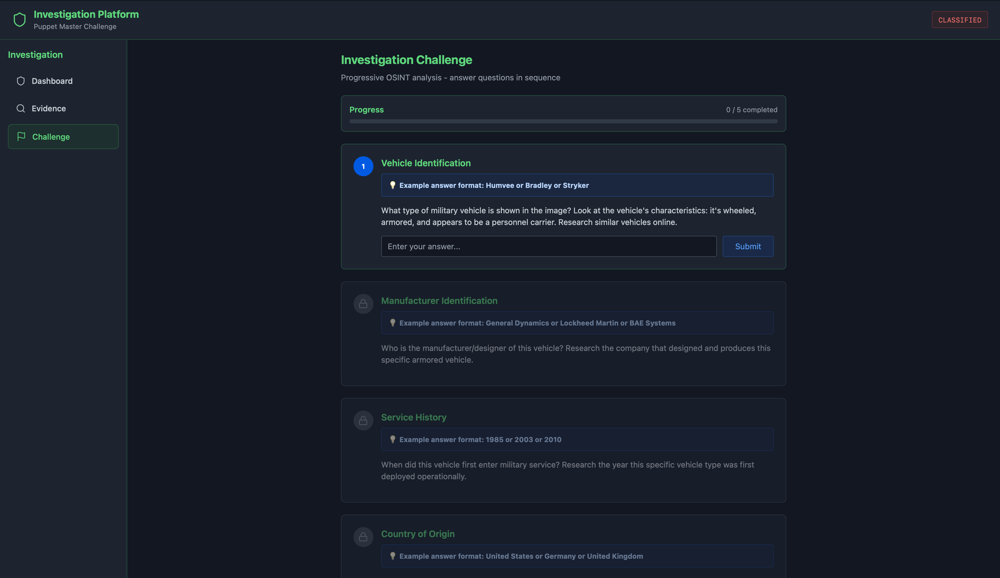
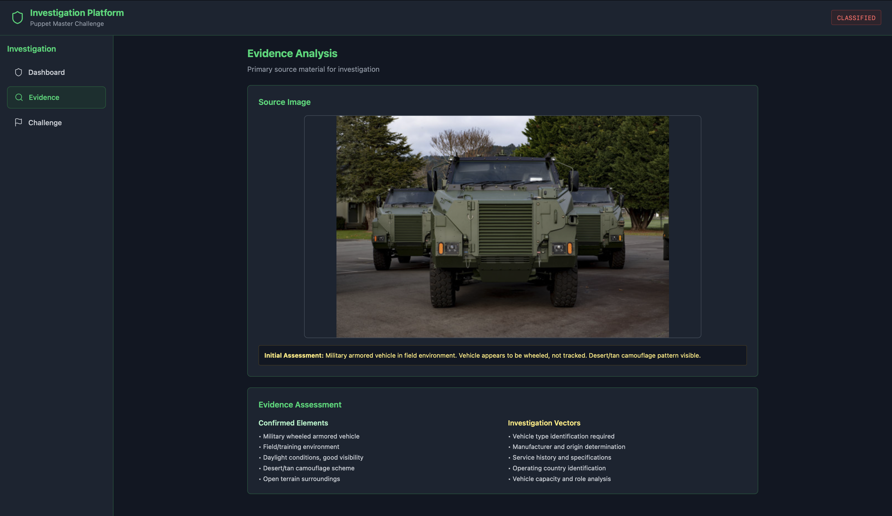
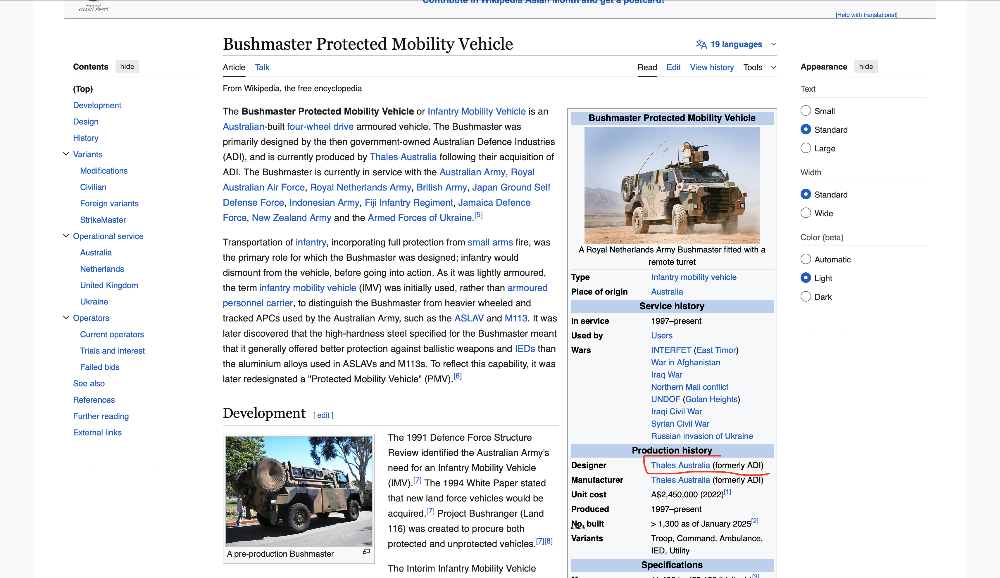
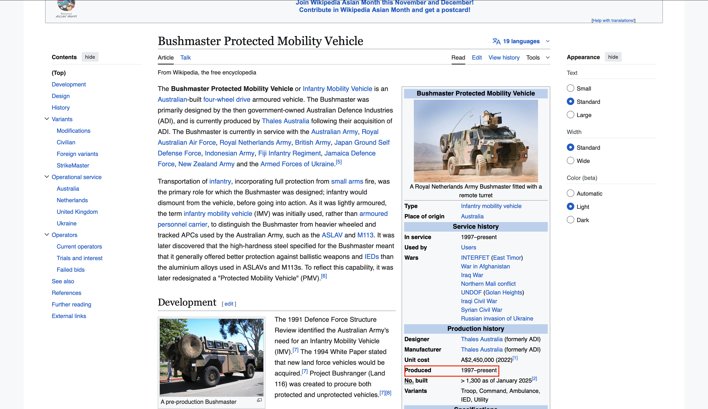
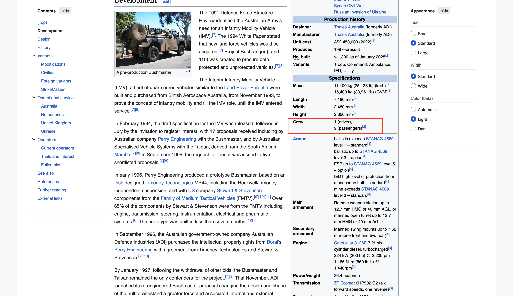

# 🛰️ Puppet Master Write-Up

**Category:** OSINT

**Difficulty:** Very Easy

**Author:** Pr1de

---

## **Introduction**

The challenge gives us a single photograph of an unknown military armored vehicle and asks us to identify everything about it using only open-source intelligence. The goal is to determine its exact model, who manufactures it, when it entered service, what country it originates from, and how many people it can carry. Since guessing is not allowed, the entire process must rely on verifiable public sources.

---

## **Image Analysis**

The provided image shows a wheeled armored vehicle positioned in what looks like a training or field environment. It has a sloped front grille, thick armor panels, a high ground clearance and the general shape of a troop carrier. Nothing in the picture directly reveals the model, so the logical next step is to perform a reverse image search.

---

## **Reverse Image Search**

I took the image and performed a Google Reverse Image Search. The results immediately returned several visually identical vehicles linked to the New Zealand Defence Force. Many of the search results referenced the same name: the *Bushmaster Protected Mobility Vehicle*. At this point the match is strong enough to investigate further, so I searched for “Armoured Bushmaster” to confirm the model.

---

## **Manufacturer Identification**

On the same Wikipedia page, in the production history section, the manufacturer is listed as Thales Australia, formerly ADI. This answers the second challenge question: the Bushmaster is designed and produced by Thales Australia.

---

## **Service Entry Year**

The information box on the right side of the page clearly states that the Bushmaster has been in service since 1997. This is the year it entered military service and therefore the correct answer for the challenge.

---

## **Country of Origin**

The page also specifies the place of origin as Australia. Since the vehicle was designed and built there, the country of origin for the Bushmaster is Australia.

---

## **Crew and Passenger Capacity**

In the specifications section, the vehicle capacity is written as one driver and nine passengers. This completes the final requirement of the challenge.

---

