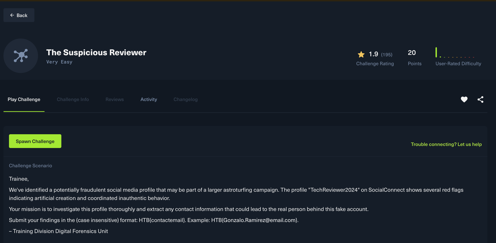
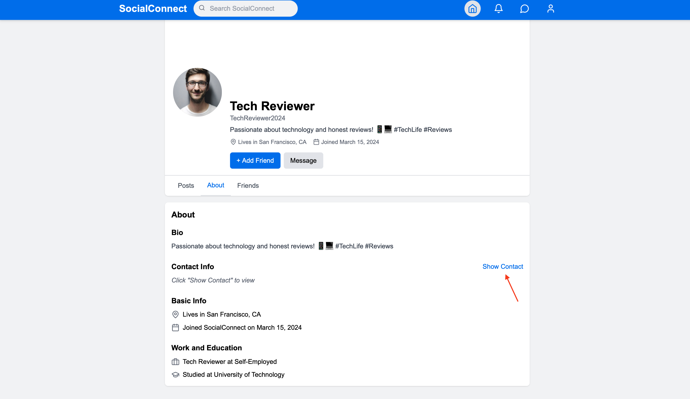

 # 🕵️‍♂️ **The Suspicious ReviewerWrite-Up**

**Category:** OSINT

**Difficulty:** Very Easy

**Points:** 20

**Author:** Pr1de

---

##  **Introduction**

The challenge drops us into a small digital-forensics scenario: a profile called **TechReviewer2024** has raised suspicion. Our mission is simple follow the traces left by this “reviewer” across the provided platforms and extract the **real contact email** behind the fake persona.

---

##  **Exploring the SocialConnect Profile**

Once the challenge is spawned, we begin at the SocialConnect page for the user **Tech Reviewer**. At first glance, the profile looks perfectly normal: a clean photo, hashtags about technology, and a predictable bio repeating the same theme technology and honest reviews.
But OSINT always starts with the basics, so we move to **About** section.

The profile hides its contact details behind a “Show Contact” button. 

Clicking *Show Contact* reveals the key piece of information we need:
**`alex.morgan@tempmail.com`**

The challenge instructions specify the submission format:
**HTB{contactemail}**

Since our investigation reveals only one contact email associated with the suspicious account, the flag becomes:

**`HTB{alex.morgan@tempmail.com}`**

