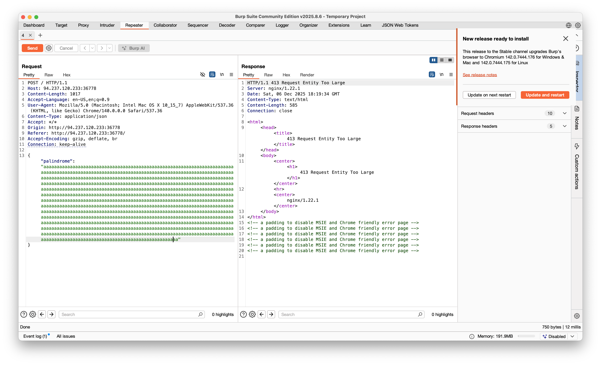
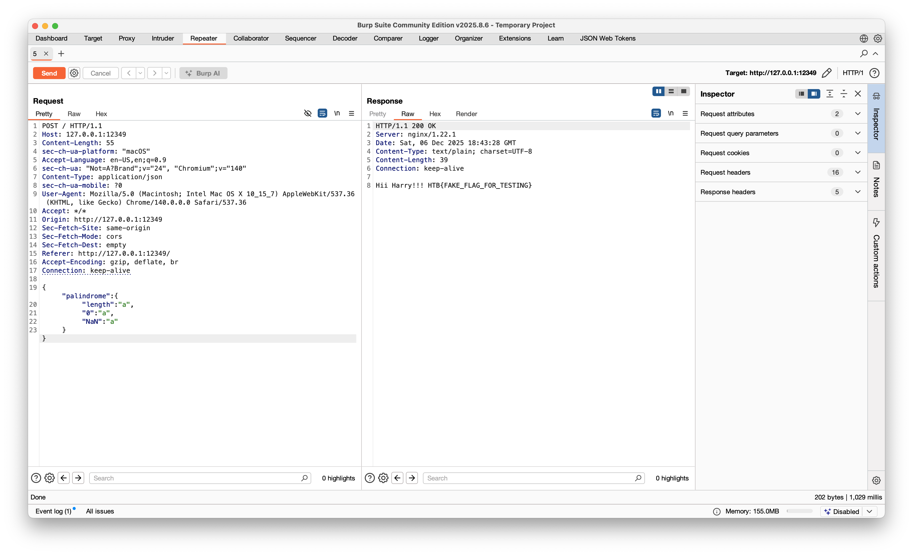

# 🪄 Magical Palindrome Write-Up

**Category:** Web Exploitation

**Difficulty:** Very Easy

**Author:** Pr1de

---

##  **Introduction**

The challenge presents a simple webpage asking the user to *“Cast a Magical Palindrome Spell.”*


Submitting any random short word returns:

```
Tootus Shortus
```

This hints that the server is checking the **length** of the input.

---

##  **Code Review**

Inspecting the page source (`index.html`) shows that the form sends a POST request with JSON:

```javascript
fetch('/', {
    method: 'POST',
    headers: { 'Content-Type': 'application/json' },
    body: JSON.stringify({ palindrome }),
});
```

Now on the backend side we have the `IsPalinDrome` function, which verifies if the input's length is at least 1000 and also checks that the type is **string** and that the string is a palindrome.

```js
const IsPalinDrome = (string) => {
	if (string.length < 1000) {
		return 'Tootus Shortus';
	}

	for (const i of Array(string.length).keys()) {
		const original = string[i];
		const reverse = string[string.length - i - 1];

		if (original !== reverse || typeof original !== 'string') {
			return 'Notter Palindromer!!';
		}
	}

	return null;
}
```

> A palindrome is a word, phrase, name, or number that reads the same forward or backward.

And for how the backend works: the backend receives the JSON from the front end, takes the body, and passes it to the `IsPalinDrome` function. If the length is more than 1000 and it is a **string** *and* a palindrome, we receive the flag; otherwise we get `Tootus Shortus` or `Notter Palindromer!!` if it's 1000 or more but doesn't verify the second condition.

```javascript
app.post('/', async (c) => {
	const {palindrome} = await c.req.json(); 
 	const error = IsPalinDrome(palindrome); 
	if (error) {
		c.status(400);
		return c.text(error);
	}
	return c.text(`Hii Harry!!! ${flag}`);
});
```

So we must send a **palindrome of length ≥ 1000**.

---

## First Attempt: Long Palindrome

Now we launch Burp Suite and capture a **POST** request and send it to Repeater, where we give as a body:

```
{
    "Palindrome" : "aaa...aaa" (1000 times)
}
```

After sending it, instead of getting the flag, we get a 413 error saying that the request entity is too large:

```
413 Request Entity Too Large
```



---

##  **Checking nginx.conf**

Looking into the `nginx.conf` file, we find that `client_max_body_size` is **75**, which means that the body, including the `{ "palindrome": ... }`, must have a maximum size of 75 bytes. This kills every hope of sending a direct payload of length 1000 in the body.

```nginx
    server {
        listen 80;
        server_name 127.0.0.1;
		client_max_body_size 75;

        location / {
            proxy_pass http://127.0.0.1:3000;
			proxy_read_timeout 5s;
        }
    }
```

So we must trick the backend into *thinking* the palindrome is long without actually sending a long string.

---

##  **The Vulnerability**

`IsPalinDrome` compares the input as if it's a **string**, but JSON allows us to send **objects**. So instead of sending 1000 characters directly, we can manually put the `length ≥ 1000` ourselves. That way, when `IsPalinDrome` tries to access `length`, it will find the value we provided.

> **Note:** In JavaScript, `.length` is just a normal property on objects, so you can overwrite it.

We can try a payload like this:

```payload
{
    "palindrome":{
        "length":1001
    }
}
```

But this won't work either even though it will pass the first check, it won't pass the palindrome check. So we need to be cleverer. We will give `"length": "a"`, which also passes the first condition, and then since the length of `"a"` is 1, to be accepted as a palindrome by the program, `input[a.length]` and `input[a.length - 1]` must both be `"a"`.

Since `a.length - 1` evaluates to `NaN`, this allows us to control the `"NaN"` index in our object. This gives us the final payload:

```payload
{
    "palindrome":{
        "length":"a",
        "0":"a",
        "NaN":"a"
    }
}
```

> The reason our payload passes the length check, even though we set the length field to “a,” is because JavaScript does something subtle behind the scenes. When the backend compares the length we provided with the number 1000, JavaScript automatically tries to convert our value into a number. Since “a” is not numeric, this conversion fails and becomes a `NaN`. In JavaScript, any comparison involving this special NaN value is always considered false. As a result, when the program checks whether our fake length is smaller than 1000, the comparison does not behave as a normal string comparison instead, it quietly evaluates to false.

So after sending that, we get the flag.


